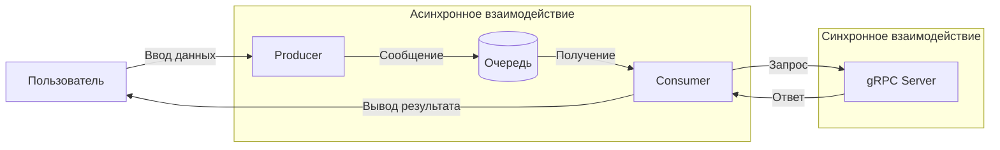

# Лабораторная работа 3.1. Организация асинхронного взаимодействия микросервисов с помощью брокера сообщений

---

## Вариант 13
## Задачи:
1. Генерация токена сброса пароля.  
   Producer отправляет email.  
   gRPC сервис генерирует токен и возвращает сообщение:  
   "Ссылка для сброса отправлена на {email}. Токен: {token}".

2. Расчёт возраста.  
   Producer отправляет дату рождения в формате `YYYY-MM-DD`.  
   gRPC сервис вычисляет полный возраст и возвращает число лет.

3. Сортировка слов.  
   Producer отправляет строку из нескольких слов.  
   gRPC сервис сортирует слова в алфавитном порядке и возвращает результат.

---

## Архитектура системы

## Общая логика работы

- Пользователь вводит сообщение в Producer

- Producer отправляет сообщение в очередь RabbitMQ

- Consumer получает сообщение из очереди

- Consumer определяет тип задачи по префиксу

- Consumer вызывает соответствующий метод gRPC

- gRPC сервер обрабатывает запрос

- Результат возвращается и выводится пользователю

## Используемые технологии
Python

gRPC

RabbitMQ

Pika

Ubuntu 20.04

## ЧАСТЬ 1. Реализация gRPC (синхронное взаимодействие)
Создан файл lab13.proto, в котором описаны три метода:

GenerateResetToken — генерация токена сброса пароля

CalculateAge — расчет возраста по дате рождения

SortWords — сортировка слов

Сгенерированы Python-файлы lab13_pb2.py и lab13_pb2_grpc.py с использованием grpc_tools.

Реализованы методы:

генерация токена на основе email

вычисление возраста с учётом дня рождения

сортировка слов в строке

Реализован gRPC сервер, который запускается на порту 50051 и ожидает запросы.

Сервер запущен и протестирован через Consumer (тестовый клиент отдельно не создавался, так как роль клиента выполняет Consumer из Части 2):

ЧАСТЬ 2. Реализация RabbitMQ (асинхронное взаимодействие)
В ходе работы RabbitMQ был развёрнут напрямую в Ubuntu без Docker из-за особенностей виртуального окружения. Эквивалентный файл docker-compose.yml для запуска брокера выглядит так:

yaml
version: '2.2'
services:
  rabbitmq:
    image: rabbitmq:3.9-management
    container_name: rabbitmq
    ports:
      - "5672:5672"
      - "15672:15672"
    environment:
      - RABBITMQ_DEFAULT_USER=guest
      - RABBITMQ_DEFAULT_PASS=guest
Фактически RabbitMQ был установлен и запущен командами:

bash
sudo apt update
sudo apt install rabbitmq-server -y
sudo systemctl start rabbitmq-server

Создан Producer, который:

принимает ввод пользователя

отправляет сообщение в очередь

Формат сообщений:

text
reset:email@example.com
age:2000-05-15
sort:яблоко банан апельсин
Создан Consumer:

получает сообщение из очереди

определяет тип команды по префиксу

вызывает соответствующий метод gRPC

выводит результат

В ходе тестирования были запущены:
RabbitMQ

gRPC сервер

Consumer

Producer

# Были выполнены запросы по всем задачам:

1. Генерация токена сброса пароля
Запрос:

text
reset:student@example.com

2. Расчёт возраста
Запрос:

text
age:2000-05-15

3. Сортировка слов
Запрос:

text
sort:яблоко банан апельсин груша

## Вывод
В ходе выполнения лабораторной работы была реализована система микросервисного взаимодействия, включающая синхронный и асинхронный подходы.

С использованием gRPC реализовано взаимодействие по модели "запрос–ответ", что позволило протестировать и изолировать бизнес-логику сервиса. Реализованы три метода согласно варианту №13: генерация токена сброса пароля, расчёт возраста, сортировка слов.

С помощью RabbitMQ реализовано асинхронное взаимодействие между компонентами системы. Producer отправляет сообщения в очередь, а Consumer обрабатывает их независимо, вызывая gRPC сервис. Это обеспечивает слабую связанность компонентов, повышает устойчивость системы и позволяет масштабировать обработку сообщений.

Использование префиксов сообщений (reset:, age:, sort:) позволило реализовать маршрутизацию задач внутри одной очереди и одного обработчика.

Все три задачи успешно реализованы и корректно обрабатываются системой.
